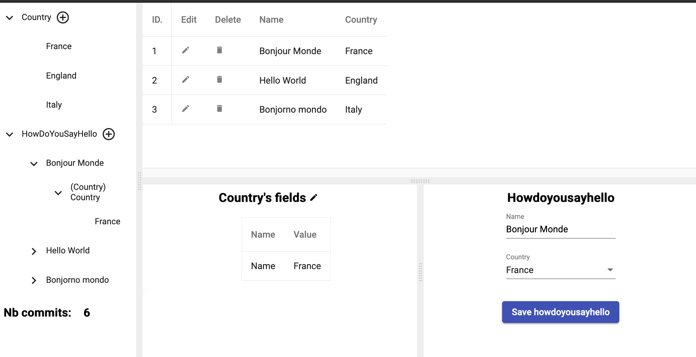

### hello world for gong

Steps to have hello world work:

1. Clone the repo
- > git clone github.com/fullstack-lang/helloworld

You should see the following 3 files:
```
helloworld % tree .
.
├── LICENSE
├── README.md // this file
├── go
│   └── models
│       └── helloworld.go // the model
└── go.mod
```
2. Install gongc (the gong compiler)
- > git clone github.com/fullstack-lang/gong
- > cd gong/stacks/gong/go/gongc
- > go install
- > cd ../../../../..

3. Compile & run hello world
- > cd helloworld/go/models; gongc

compilation should last less than a minute ("npm install" is the longuest operation)

Go back to the root directory of the helloworld repo
- > cd ../..

update the go needed modules 
- > go mod tidy

launch helloworld
- > go run main.go

```
helloworld % go run main.go
helloworld: Database Migration of package github.com/fullstack-lang/helloworld/go is OK
helloworld: Server ready serve on localhost:8080
```


1. Use hello world
- launch browser on http://localhost:8080

### what you should see

